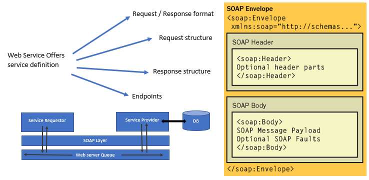

## Ravaan Techky
REST Example

### Overview:
Types of Webservices:
- SOAP
	- **SOAP** stands for **Simple Object Access Protocol**
	- **Data Exchange Format:** XML format request and response
	- **Transport:** SOAP can be used where transportation happend over the HTTP OR MQ
	- **Service Definition:** WSDL [Web Service Definition Language]. 1] Design for machine to machine OR application to application interaction. 2] Should be inter-operable i.e. not machine /platform dependent 3] should allow communication over a network.
	- 

- REST
	- **ReST** stands for **Representation State Transfer**
	- **Data Exchange Format:** No restriction. JSON (JavaScript Object Notation) is popular
	- **Transport:** Only HTTP
	- ** Service Definition:** No Standard - WADL / Swagger
	- **REST supported HTTP Method** - GET, POST, DELETE, PUT, etc.
	- **REST supported HTTP Status Codes** - 200 (Accepted), 201 (Created), 400 (Bad Request), etc.
	- Make the best use of HTTP
	- Resource can be send in request by - 1] a part of URI 2] A resource can have different representations - XML, JSON / HTML

Spring Microservices components
- Config Server
- Ribbon & Feign
- Naming server & Eureka
- API Gateway with ZUUL
- Distributed tracing with ZipKin
- Fault tolerance with Hystrix


### Language is base on philosophy:
```markdown
- Beautiful is better than Ugly.
- Explicit is better than Implicit
- Simple is better than complex
- Complex is better than Complicated
- Increase Readability counts
```

<br/><br/>
[<i class="fa fa-arrow-left"></i> **Back**](/documentation/)
